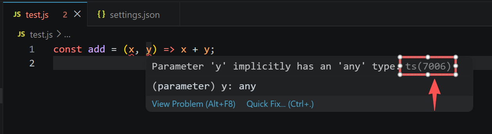
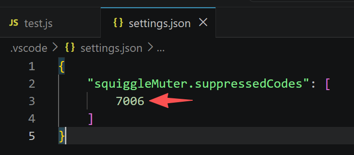

# Squiggle Muter

IntelliSense without the nagging.

Hide unwanted squiggles while keeping the powerful editor assistance
provided by the TypeScript language service.

## Usage

**Step 1** — Hover over a squiggle and note the code in the tooltip.
It looks like this: `ts(7006)`. The number is what you need.



**Step 2** — Add the code to your user settings:

```json
"squiggleMuter.suppressedCodes": [7006]
```



The setting is global — it applies to all projects automatically.
No per-project configuration needed.

## How it works

Most extensions that claim to suppress squiggles do it the lazy way —
they change the squiggle color to transparent, or toggle an editor-level
setting that nukes everything at once. The Problems panel still fills up.
The diagnostics are still running. Nothing is actually gone.

And if you've tried to silence specific JavaScript diagnostics in VS Code,
you already know the dirty secret: the only built-in way to do it is to
disable the TypeScript language service entirely. That means losing
IntelliSense, auto-imports, type inference, go-to-definition — everything.

Squiggle Muter works differently.

It runs as a **TypeScript language service plugin** — deep inside the same
tsserver process that powers all of the above. It intercepts diagnostics at
the source, before they are emitted, before they reach the editor, before
they touch the Problems panel. If a code is on your suppression list, it
simply does not exist.

Full language service. Zero unwanted noise. No compromises.

## What it suppresses

Squiggle Muter targets diagnostics produced by VS Code's built-in
**TypeScript Language Service** — the engine that powers IntelliSense,
type checking, and semantic analysis for both JavaScript and TypeScript
files.

You can identify these diagnostics by the `ts(xxxx)` marker at the end
of the hover tooltip. Squiggle Muter only acts on these. Diagnostics from
ESLint, Prettier, or any other linter are not affected.

## Finding a diagnostic code

Hover over any squiggle in the editor. The code appears at the end of the
tooltip in parentheses, for example `ts(7006)`.

## Common codes

| Code  | Description                                                    |
| ----- | -------------------------------------------------------------- |
| 7044  | Could not find a declaration file for module                   |
| 7006  | Parameter implicitly has an 'any' type                         |
| 80001 | File is a CommonJS module; it may be converted to an ES module |
| 2304  | Cannot find name                                               |
| 2307  | Cannot find module                                             |
| 2322  | Type is not assignable                                         |
